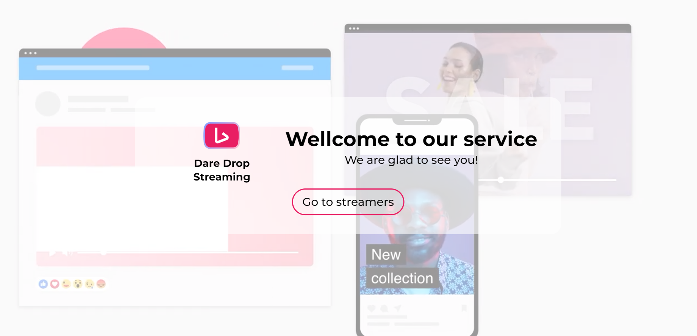
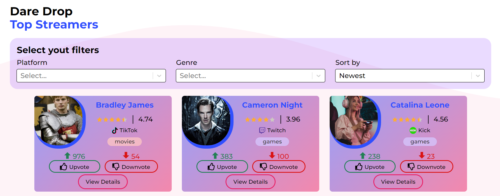
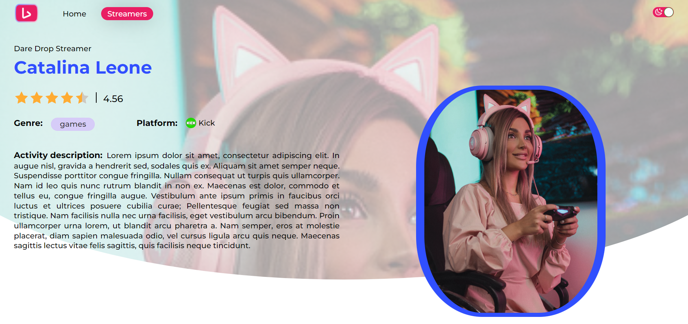
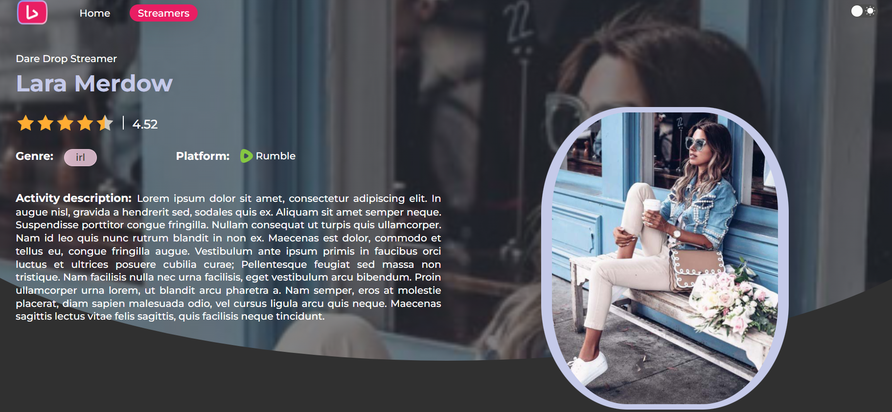

# Dare Drop Streaming Frontend

This is an adaptive Dare Drop Streaming web-app, created on terms of the Dare
Drop test task. It allows to watch after new streamers and their ratings in real
time, add favorite streamers on server, vote for them, find some info about
them.

## Website content

### Homepage

The App starts with homepage with video background and greeting message for any
new user. It also contains button, that leads to the streamers page.



### Sreamers

Streamers page contains main functional of the web-app. It starts with the form,
which allows to add new streamer to the platform. After the form submition new
streamer will be added to the list below.

List of streamers is renewing in real time. Users can filter streamers by
streaming platform, activity genre, activity note creation date (newest/oldest),
or upvotes/downvotes rate.

Under the list users can found controllers, allowing easily move through filtred
results from page to page.



Each streamer's card includes streamer's name, activity genre, prefered
platform, and number of current upvotes/downvotes renewed in real time. It also
indicates 5 star based rating, calculated basing on votes ratio. At the end of
each card there is a button link leading on the streamer's personal page.

### Sreamer page

Streamer page provides user with info about streamer, giving streamer's name,
photo, activity genre and description, prefered genre, and general rating (not
renewed in real time).



### Additional features

Each pages header includes toggle theme button allowing users choose prefered
color mode.



## Deploy

The frontend part of the web-app is deployed on gh-pages. Live version of the
app is avaliable at
[link](https://milosska.github.io/daredrop-streaming-frontend)

```javascript
'https://milosska.github.io/daredrop-streaming-frontend';
```

## Technology stack

Frontend part of the web-app was created using indicated tech stack:

<code></code>
<code></code>
<code></code>
<code></code>
<code></code>
<code></code>
<code></code>
<code></code>
<code></code>
<code></code>
<code></code>
<code></code>
<code></code>
